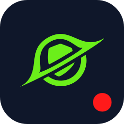
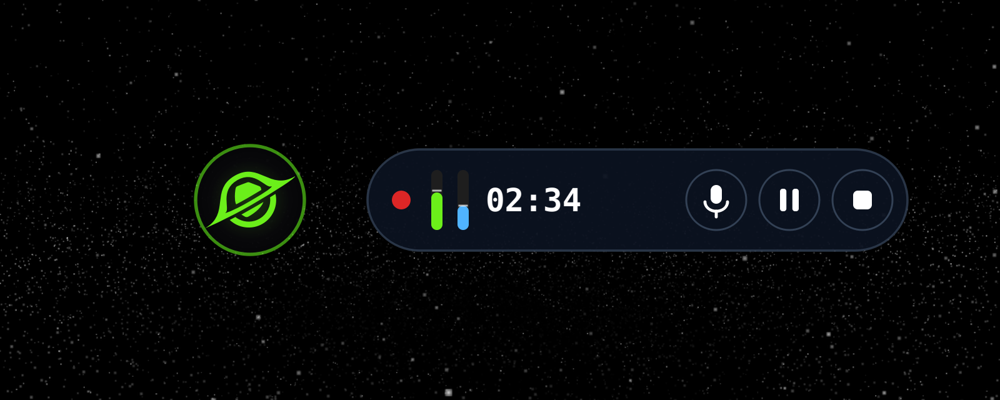
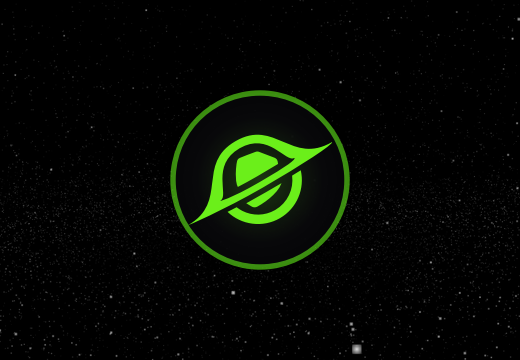
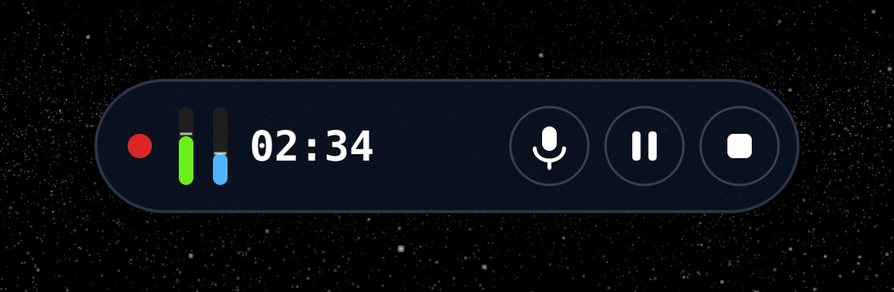
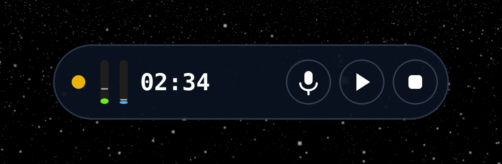
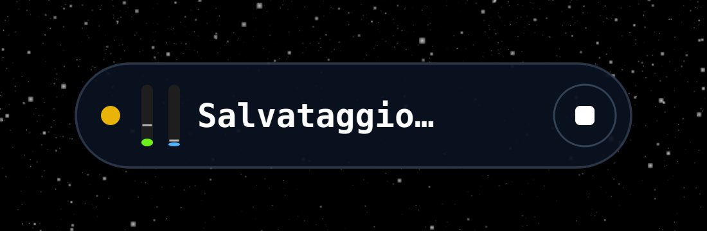
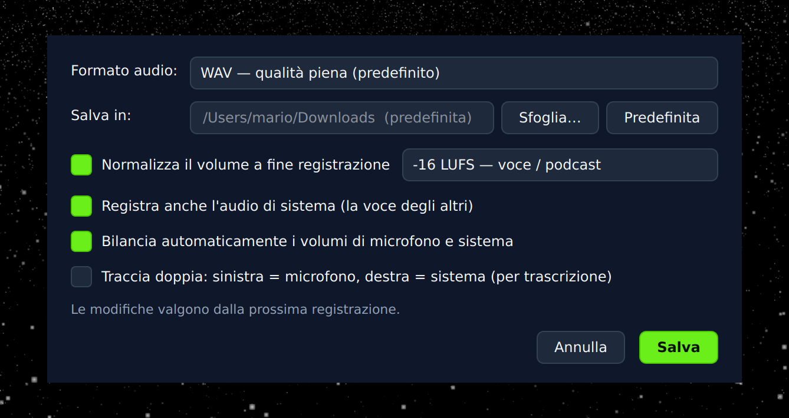

<div align="center">



# Orizon Call

**Il registratore di chiamate di Orizon: microfono + audio di sistema, in un unico file.**

Widget flottante sempre in primo piano · Nessun driver audio da installare · macOS, Windows e Linux

[](https://github.com/zano97/orizon-call/actions/workflows/ci.yml)




</div>

---

## A cosa serve

Orizon Call è l'app desktop companion della web app Orizon. Registra le tue
call catturando **contemporaneamente il tuo microfono e l'audio di sistema**
(la voce degli altri partecipanti in Meet/Zoom/Teams o qualunque cosa suoni
dal computer) e li mixa in un unico file perfettamente allineato, pronto per
l'archiviazione o la trascrizione.

Non serve installare driver audio virtuali (niente BlackHole, niente
Soundflower): su macOS 13+ usa un helper nativo basato su ScreenCaptureKit,
su Windows il loopback WASAPI, su Linux i monitor source di
PulseAudio/PipeWire.

## Installazione (un solo comando)

### macOS / Linux

Apri il Terminale e incolla:

```bash
curl -fsSL https://raw.githubusercontent.com/zano97/orizon-call/master/install.sh | bash
```

### Windows 10/11

Apri **PowerShell** e incolla:

```powershell
irm https://raw.githubusercontent.com/zano97/orizon-call/master/install.ps1 | iex
```

Fine. L'installer fa tutto da solo:

1. controlla i prerequisiti (Python ≥ 3.10, su Linux la libreria PortAudio)
   e dove possibile **li installa automaticamente**;
2. scarica l'app da GitHub e crea un ambiente Python **isolato** (non tocca
   il Python di sistema);
3. installa il comando **`orizon-call`** nel terminale e l'icona per
   avviarla con un click: su macOS in `~/Applications`, su Linux nel menu
   applicazioni, su Windows nel menu Start e sul Desktop.

Al termine avvii l'app con:

```bash
orizon-call
```

…oppure cliccando l'icona **Orizon Call**.

| Azione | Comando |
|---|---|
| Aggiornare all'ultima versione | `orizon-call update` |
| Disinstallare (le registrazioni restano) | `orizon-call uninstall` |
| Vedere tutte le opzioni | `orizon-call --help` |

> **Permessi macOS** — al primo avvio macOS chiede l'accesso al
> **Microfono** e alla **Registrazione schermo**: quest'ultima è il permesso
> che ScreenCaptureKit usa per catturare l'audio di sistema (lo schermo non
> viene mai registrato). Si concede una sola volta.

> **MP3 e normalizzazione volume funzionano subito**: l'app include un
> ffmpeg statico (via `imageio-ffmpeg`), su tutti i sistemi. Se sul
> computer c'è già un ffmpeg di sistema, viene usato quello.

## Come si usa

Avviata l'app, in basso a destra compare un cerchio con il logo Orizon,
sempre sopra tutte le finestre (anche le app a tutto schermo su macOS).

<div align="center">

</div>

- **Click sul cerchio** → parte la registrazione: il cerchio si espande in
  una "pillola" con timer, indicatore REC e VU meter di microfono (verde) e
  audio di sistema (blu).
- **Trascina** il widget dove vuoi: la posizione viene ricordata.
- **Click destro** → menu completo (avvia/stop, pausa, mute, impostazioni,
  apri cartella registrazioni, esci).

<div align="center">

</div>

Durante la registrazione i tre pulsanti sono, nell'ordine: **mute
microfono** (l'audio di sistema continua a registrare), **pausa/riprendi**
e **stop**.

<div align="center">

&nbsp;

</div>

Premuto stop, il file viene finalizzato in background («Salvataggio…»: la
UI non si blocca mai, nemmeno con ore di audio) e una notifica ti porta
dritto al file.

### Impostazioni

Click destro sul widget → **Impostazioni…**: da qui scegli come salvare
l'audio, senza toccare il terminale. Le scelte restano memorizzate.

<div align="center">

</div>

- **Formato audio** — WAV (qualità piena), FLAC (senza perdite) o MP3
  (leggero, da condividere).
- **Salva in** — la cartella di destinazione (predefinita: `~/Downloads`).
- **Normalizza il volume** — porta la registrazione a -16 LUFS (voce /
  podcast) o -14 LUFS (streaming) a fine registrazione.
- **Audio di sistema**, **auto-bilanciamento**, **traccia doppia**
  (sinistra = microfono, destra = sistema: comoda per la trascrizione).

### Dove finiscono le registrazioni

`recording_YYYYMMDD_HHMMSS.{wav,flac,mp3}` nella cartella scelta nelle
impostazioni (predefinita: `~/Downloads`). Ogni WAV ha un sidecar `.json`
con i metadati (durata, layout canali, segmenti). Le registrazioni oltre
~5 ore vengono divise automaticamente in segmenti `_part2`, `_part3`, …

### Opzioni da terminale (facoltative)

Tutto ciò che sta nelle impostazioni si può forzare anche da terminale per
una singola sessione (i flag non modificano le impostazioni salvate):

```bash
orizon-call --format mp3       # forza il formato per questa sessione
orizon-call --dual-track       # stereo L=microfono, R=sistema (per trascrizione)
orizon-call --normalize        # normalizza il volume a -16 LUFS dopo lo stop
orizon-call --preroll 5        # buffer di pre-roll: non perdi l'inizio call
orizon-call --no-system-audio  # solo microfono
orizon-call --output-dir DIR   # cartella di destinazione
orizon-call --help             # tutte le opzioni
```

## Caratteristiche

- **Widget flottante** sopra tutte le finestre: cerchio quando inattivo,
  pillola con timer, VU meter, mute, pausa e stop durante la registrazione.
  Salvataggio asincrono: la UI non si blocca mai.
- **Audio di sistema senza driver**: macOS 13+ (helper ScreenCaptureKit),
  Windows (WASAPI loopback), Linux (monitor PulseAudio/PipeWire).
- **Mix allineato al campione**: le due sorgenti sono scritte solo nella
  parte sovrapposta realmente catturata; mai zeri inseriti a casaccio, mai
  tracce sfasate. Ricampionamento streaming (soxr) senza click.
- **Auto-bilanciamento** del volume mic/sistema (attacco lento, gain rampato
  per blocco: niente pompaggio).
- **Robustezza**: header WAV sempre consistente su disco (un crash duro
  lascia un file riproducibile), watchdog con recovery di mic/helper,
  salvataggio d'emergenza su SIGINT/SIGTERM, auto-stop pulito a disco pieno,
  mai perdita del WAV se la conversione MP3 fallisce.
- **API locale sicura**: bind solo su 127.0.0.1, bearer token (mai nei log),
  validazione Host anti DNS-rebinding, CORS ristretto a origin loopback
  canonici, protezione path-traversal/symlink sui download, SSE event-driven
  per aggiornamenti di stato istantanei.

## Integrazione con la web app Orizon

L'app espone una REST API locale (`http://127.0.0.1:19876`) con cui la web
app può avviare/fermare la registrazione, leggere lo stato in tempo reale
via SSE e scaricare i file. Tutta la documentazione (endpoint, auth, esempi
JavaScript) è in [INTEGRATION_GUIDE.txt](INTEGRATION_GUIDE.txt).

## Per sviluppatori

```bash
git clone https://github.com/zano97/orizon-call
cd orizon-call
./start.sh                     # primo avvio: venv + dipendenze + helper
```

In alternativa manuale: `pip install -r requirements.txt && python3 main.py`.

**Test** (110+ casi: allineamento writer, state machine, API, sicurezza):

```bash
pip install -r requirements-dev.txt
python3 -m pytest tests/
```

**Helper audio macOS** — il binario precompilato è in
`helpers/system_audio_capture`; per ricompilarlo servono gli Xcode Command
Line Tools: `cd helpers && ./build.sh`. Diagnostica cattura:
`python3 diag_sck.py`.

**Design** — icone, logo e palette provengono dal design system ufficiale
[orizon-design-theme](https://github.com/Orizon-eu/orizon-design-theme)
(verde brand `#6bef1a`, scala slate).

## Risoluzione problemi

| Problema | Soluzione |
|---|---|
| macOS: «audio di sistema non disponibile» | Impostazioni di Sistema → Privacy e Sicurezza → **Registrazione schermo** → abilita l'app (o il Terminale), poi riavvia Orizon Call |
| Linux: `PortAudio library not found` | `sudo apt install libportaudio2` (Debian/Ubuntu) / `sudo dnf install portaudio` (Fedora) |
| Linux: il widget non resta in primo piano su Wayland | Comportamento noto di alcuni compositor: il widget si ri-alza da solo ogni pochi secondi |
| L'export MP3 non parte | Non dovrebbe più succedere (ffmpeg è incluso); in ogni caso il WAV originale non viene mai perso — controlla i log |
| «Un'altra istanza è già in esecuzione» | C'è già un Orizon Call attivo (controlla il widget); oppure usa `--api-port` per cambiare porta |
| Log dettagliati | `orizon-call --verbose`, file di log in `~/.orizon-call/logs/` |
