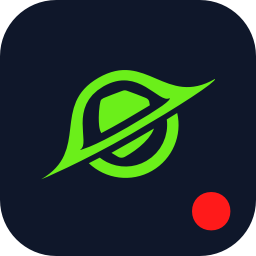
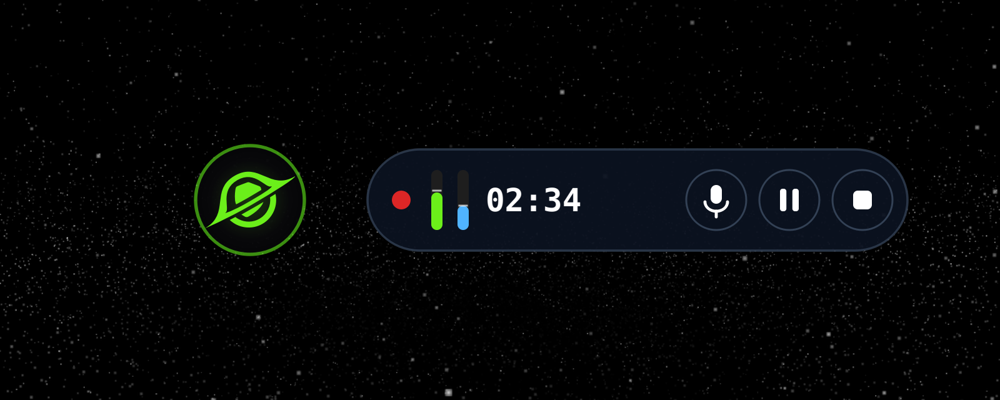
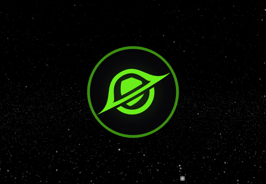
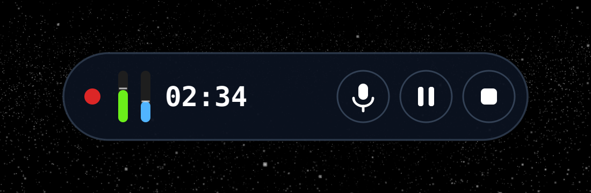
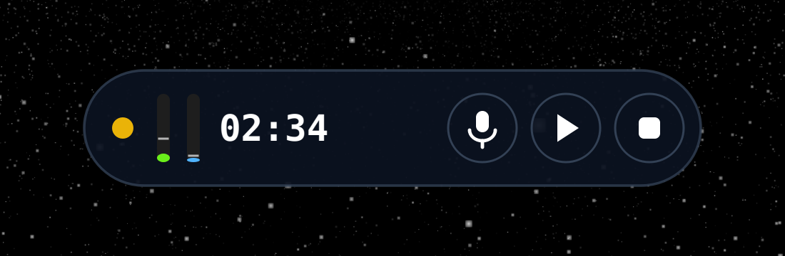
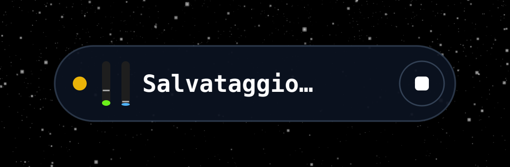
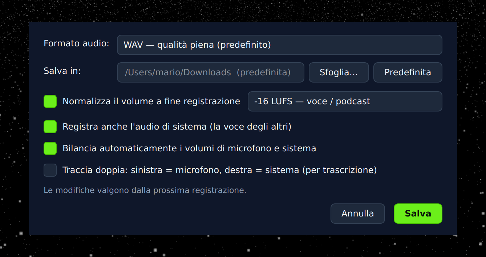

<div align="center">



# Orizon Call

**Il registratore di chiamate di Orizon: microfono + audio di sistema, in un unico file.**

Widget flottante sempre in primo piano · Nessun driver audio da installare · macOS, Windows e Linux

[](https://github.com/zano97/orizon-call/actions/workflows/ci.yml)




</div>

---

## A cosa serve

Orizon Call è l'app desktop companion della web app Orizon. Registra le tue
call catturando **contemporaneamente il tuo microfono e l'audio di sistema**
(la voce degli altri partecipanti in Meet/Zoom/Teams o qualunque cosa suoni
dal computer) e li mixa in un unico file perfettamente allineato, pronto per
l'archiviazione o la trascrizione.

Non serve installare driver audio virtuali (niente BlackHole, niente
Soundflower): su macOS 13+ usa un helper nativo basato su ScreenCaptureKit,
su Windows il loopback WASAPI, su Linux i monitor source di
PulseAudio/PipeWire.

## Installazione

Scarica il file per il tuo sistema dall'ultima versione nella pagina
**[Releases](https://github.com/zano97/orizon-call/releases/latest)**: è
un'app completa, non serve installare Python né usare il terminale.

| Sistema | File da scaricare | Come si installa |
|---|---|---|
| **macOS** Apple Silicon (M1, M2…) | `OrizonCall-<versione>-macos-arm64.dmg` | Apri il `.dmg` e trascina **Orizon Call** in **Applicazioni** |
| **macOS** Intel | `OrizonCall-<versione>-macos-x86_64.dmg` | Come sopra |
| **Windows** 10/11 | `OrizonCall-<versione>-windows-x64-setup.exe` | Doppio click e **Installa**: niente permessi di amministratore |
| **Linux** (x86_64) | `OrizonCall-<versione>-linux-x86_64.AppImage` | Rendilo eseguibile (tasto destro → Proprietà → *Consenti l'esecuzione*, oppure `chmod +x`) e aprilo con doppio click |

Al primo avvio l'app si integra da sola: su Linux compare nel menu delle
applicazioni, su macOS (se l'hai aperta direttamente dal `.dmg`) propone
di spostarsi in **Applicazioni**, su Windows è nel menu Start (e, se lo
scegli in installazione, sul Desktop e all'avvio di Windows).

**Aggiornamenti**: non devi più scaricare nulla a mano. Quando esce una
nuova versione l'app la scarica in background, ti mostra le novità e, con
un click su **Aggiorna e riavvia**, si chiude e si riapre aggiornata
(dettagli in [Aggiornamenti automatici](#aggiornamenti-automatici)).

> **Primo avvio di una versione non firmata** — finché l'app non è firmata
> con un certificato Apple/Microsoft (vedi [RELEASING.md](RELEASING.md)):
> - **macOS**: se compare «non può essere aperta perché lo sviluppatore non
>   può essere verificato», apri **Impostazioni di Sistema → Privacy e
>   sicurezza** e premi **Apri comunque** (una sola volta);
> - **Windows**: se compare «Windows ha protetto il PC», premi **Ulteriori
>   informazioni → Esegui comunque** (una sola volta).
>
> Con la firma questi avvisi spariscono e, su macOS, i permessi restano
> validi anche dopo gli aggiornamenti.

> **Permessi macOS** — al primo avvio macOS chiede l'accesso al
> **Microfono** e alla **Registrazione schermo**: quest'ultima è il permesso
> che ScreenCaptureKit usa per catturare l'audio di sistema (lo schermo non
> viene mai registrato). Si concedono a «Orizon Call», una sola volta.

> **Linux** — serve un sistema con PulseAudio o PipeWire (tutte le
> distribuzioni desktop recenti) e il plugin ALSA per l'audio di sistema:
> `sudo apt install libasound2-plugins` (Debian/Ubuntu),
> `alsa-plugins-pulseaudio` o `pipewire-alsa` (Fedora). L'AppImage gira su
> Ubuntu 22.04 o più recenti e distribuzioni equivalenti.

**Disinstallare** (le registrazioni restano dove sono): su macOS trascina
l'app nel Cestino; su Windows da **Impostazioni → App → Orizon Call →
Disinstalla**; su Linux elimina il file `.AppImage` (e, se vuoi,
`~/.local/share/applications/orizon-call.desktop`).

<details>
<summary><b>Installazione da terminale (sviluppatori)</b></summary>

Installa il codice sorgente in un ambiente Python isolato. Serve l'accesso
al repository e la **GitHub CLI** autenticata (`gh auth login`).

```bash
# macOS / Linux
gh api -H "Accept: application/vnd.github.raw" repos/zano97/orizon-call/contents/install.sh | bash
```

```powershell
# Windows (PowerShell)
gh api -H "Accept: application/vnd.github.raw" repos/zano97/orizon-call/contents/install.ps1 | Out-String | iex
```

Poi: `orizon-call` per avviarla, `orizon-call update` per aggiornarla
(anche questa copia propone gli aggiornamenti quando esce una nuova
versione), `orizon-call uninstall` per rimuoverla.

</details>

> **MP3 e normalizzazione volume funzionano subito**: l'app include ffmpeg,
> su tutti i sistemi. Se sul computer c'è già un ffmpeg di sistema, viene
> usato quello.

## Come si usa

Avviata l'app, in basso a destra compare un cerchio con il logo Orizon,
sempre sopra tutte le finestre (anche le app a tutto schermo su macOS).

<div align="center">

</div>

- **Click sul cerchio** → parte la registrazione: il cerchio si espande in
  una "pillola" con timer, indicatore REC e VU meter di microfono (verde) e
  audio di sistema (blu).
- **Trascina** il widget dove vuoi: la posizione viene ricordata.
- **Click destro** → menu completo (avvia/stop, pausa, mute, impostazioni,
  apri cartella registrazioni, esci).
- **Icona nella barra di stato** (menu bar su macOS, area di notifica su
  Windows/Linux): gli stessi comandi più «Mostra il widget», per ritrovarlo
  se finisce dietro un'app a tutto schermo o su un monitor scollegato.

<div align="center">

</div>

Durante la registrazione i tre pulsanti sono, nell'ordine: **mute
microfono** (l'audio di sistema continua a registrare), **pausa/riprendi**
e **stop**.

<div align="center">

&nbsp;

</div>

Premuto stop, il file viene finalizzato in background («Salvataggio…»: la
UI non si blocca mai, nemmeno con ore di audio) e una notifica ti porta
dritto al file.

### Impostazioni

Click destro sul widget → **Impostazioni…**: da qui scegli come salvare
l'audio, senza toccare il terminale. Le scelte restano memorizzate.

<div align="center">

</div>

- **Formato audio** — WAV (qualità piena), FLAC (senza perdite) o MP3
  (leggero, da condividere).
- **Salva in** — la cartella di destinazione (predefinita: la cartella
  Download del sistema, es. `~/Scaricati` su un desktop Linux italiano).
- **Normalizza il volume** — porta la registrazione a -16 LUFS (voce /
  podcast) o -14 LUFS (streaming) a fine registrazione (EBU R128 a due
  passate: un solo guadagno lineare, niente «pompaggio»).
- **Audio di sistema**, **auto-bilanciamento**, **traccia doppia**
  (sinistra = microfono, destra = sistema: comoda per la trascrizione).
  Le modifiche valgono subito dalla registrazione successiva, senza riavvio.

### Aggiornamenti automatici

L'app controlla da sola se è uscita una nuova versione (poco dopo l'avvio e
poi ogni 6 ore). Quando c'è, la **scarica in background**, ne verifica
l'integrità (SHA-256 e, su macOS, la firma) e solo allora te la propone,
con le novità principali:

- **Aggiorna e riavvia** → l'app si chiude e si riapre aggiornata in pochi
  secondi (macOS sostituisce l'app in Applicazioni, Windows esegue il nuovo
  installer in modo silenzioso, Linux sostituisce il file AppImage);
  all'avvio una notifica conferma «aggiornato alla versione …»;
- **Più tardi** → te lo ripropone il giorno dopo.

Non interrompe mai una registrazione: se l'aggiornamento è pronto durante
una call, viene proposto quando premi stop. Puoi anche controllare a mano
dal menu (click destro o icona nella barra di stato) → **Controlla
aggiornamenti**, e disattivare il controllo da **Impostazioni →
Aggiornamenti** (o per una sessione con `--no-update-check`). La versione
installata è scritta in fondo alle Impostazioni.

Se qualcosa va storto resta la versione precedente e il dettaglio è in
`~/.orizon-call/logs/update.log`. Se le versioni sono pubblicate su un
repository privato, l'app usa la GitHub CLI collegata (`gh auth login`) o
`GITHUB_TOKEN`; con un repository pubblico non serve nulla.

### Invisibile a chi vede il tuo schermo

Quando condividi lo schermo in Meet, Zoom o Teams (o fai una registrazione
dello schermo) il widget **resta visibile a te ma non compare agli altri**:
lo stesso vale per notifiche, menu e finestre dell'app. È attivo di
default; si disattiva da **Impostazioni → Privacy e call** (o per una
sessione con `--show-in-screen-share`).

| Sistema | Come funziona |
|---|---|
| Windows 10 (2004+) / 11 | La finestra viene esclusa dalla cattura (`WDA_EXCLUDEFROMCAPTURE`). Su Windows più vecchi appare come un rettangolo nero: il contenuto resta comunque nascosto |
| macOS | Finestra marcata come non condivisibile (`NSWindowSharingNone`). Su macOS 15+ alcune app che catturano tramite ScreenCaptureKit possono ignorarlo: è una scelta di Apple, senza API pubbliche per evitarlo |
| Linux | Non supportato: né X11 né Wayland permettono a un'app di nascondersi dalla cattura |

### Rilevamento automatico delle call

Quando un'altra app inizia a usare il microfono (la proposta compare in circa 2 secondi) (Meet
nel browser, Zoom, Teams, Slack, Discord, FaceTime, WhatsApp…), Orizon Call
capisce che è partita una call e sopra il widget compare una proposta:

- **Registra** → avvia la registrazione;
- **Non ora** → per questa call non chiede più;
- **Mai per quest'app** → non propone più le call di quell'app (si
  ripristina dalle Impostazioni).

Quando l'app rilascia il microfono (la call è finita) e stai registrando
quella call, Orizon Call propone **Stop e salva**. Anche la proposta è
invisibile a chi vede il tuo schermo.

Da **Impostazioni → Privacy e call → Quando inizia una call** scegli:
*Proponi di registrarla* (predefinito), *Avvia subito la registrazione*
(e la ferma da sola a fine call, se l'aveva avviata lei) oppure *Non fare
nulla*. Per una singola sessione: `--call-detection off|propose|auto`.

Il rilevamento non legge audio né contenuti: guarda solo **quale app tiene
aperto il microfono** — su Windows tramite il registro privacy del sistema
(lo stesso dell'icona del microfono nella barra), su macOS 14.2+ tramite
CoreAudio per processo (su macOS precedenti a livello di dispositivo, e
quindi solo mentre Orizon Call non sta registrando), su Linux tramite gli
stream di registrazione di PulseAudio/PipeWire.

Tastiera (con il widget attivo, ad es. dopo «Mostra il widget» dalla tray):
**Spazio/Invio** avvia o ferma, **P** pausa, **M** mute.

### Dove finiscono le registrazioni

`recording_YYYYMMDD_HHMMSS.{wav,flac,mp3}` nella cartella scelta nelle
impostazioni (predefinita: `~/Downloads`; se non esiste viene creata). Ogni
WAV e MP3 ha un sidecar `.json` con i metadati (durata, layout canali,
segmenti). Le registrazioni oltre ~5 ore vengono divise automaticamente in
segmenti `_part2`, `_part3`, …

### Opzioni da terminale (facoltative)

Tutto ciò che sta nelle impostazioni si può forzare anche da terminale per
una singola sessione (i flag non modificano le impostazioni salvate):

```bash
orizon-call --format mp3       # forza il formato per questa sessione
orizon-call --dual-track       # stereo L=microfono, R=sistema (per trascrizione)
orizon-call --normalize        # normalizza il volume a -16 LUFS dopo lo stop
orizon-call --preroll 5        # buffer di pre-roll: non perdi l'inizio call
orizon-call --no-system-audio  # solo microfono
orizon-call --output-dir DIR   # cartella di destinazione
orizon-call --call-detection auto   # rilevamento call: off | propose | auto
orizon-call --show-in-screen-share  # il widget compare nella condivisione schermo
orizon-call --no-update-check      # niente controllo aggiornamenti in questa sessione
orizon-call --help             # tutte le opzioni
```

## Caratteristiche

- **Widget flottante** sopra tutte le finestre: cerchio quando inattivo,
  pillola con timer, VU meter, mute, pausa e stop durante la registrazione.
  Salvataggio asincrono: la UI non si blocca mai.
- **Invisibile nella condivisione schermo** (Windows e macOS): il widget lo
  vedi solo tu, non chi guarda il tuo schermo condiviso.
- **Rilevamento automatico delle call**: quando un'altra app usa il
  microfono propone di registrare (o registra da sola) e a fine call
  propone di salvare.
- **App installabile su tutti e tre i sistemi** (`.dmg`, installer Windows,
  AppImage) e **aggiornamenti dall'app**: scarica e verifica in background,
  si aggiorna e si riapre da sola, mai durante una registrazione.
- **Audio di sistema senza driver**: macOS 13+ (helper ScreenCaptureKit),
  Windows (WASAPI loopback), Linux (monitor PulseAudio/PipeWire).
- **Mix allineato al campione**: le due sorgenti sono scritte solo nella
  parte sovrapposta realmente catturata; mai zeri inseriti a casaccio, mai
  tracce sfasate. Ricampionamento streaming (soxr) senza click.
- **Auto-bilanciamento** del volume mic/sistema (attacco lento con costante
  di tempo fissa, gain rampato: niente pompaggio) e somma a guadagno unitario
  con soft-limiter: una registrazione solo-microfono e una mista hanno lo
  stesso volume.
- **Allineamento robusto**: un chunk perso sotto carico diventa silenzio
  della stessa durata (mai uno sfasamento), una sorgente che torna dopo un
  buco viene riallineata con l'audio catturato nello stesso istante, la
  deriva tra i clock dei due dispositivi è corretta 10 ms alla volta.
- **Dispositivi ri-rilevati a ogni avvio** della registrazione: cuffie
  collegate dopo l'apertura dell'app funzionano; senza microfono all'avvio
  l'app parte comunque.
- **Robustezza**: header WAV sempre consistente su disco (un crash duro
  lascia un file riproducibile), watchdog con recovery di mic/helper,
  Ctrl+C / SIGTERM / chiusura della finestra = stop pulito con salvataggio
  completo (secondo segnale = salvataggio d'emergenza immediato), auto-stop
  pulito a disco pieno, conteggio degli overflow del driver audio, mai
  perdita del WAV se la conversione MP3 fallisce.
- **API locale sicura**: bind solo su 127.0.0.1, bearer token (mai nei log),
  validazione Host anti DNS-rebinding, CORS ristretto a origin loopback
  canonici (con Private Network Access di Chrome), protezione
  path-traversal/symlink sui download, byte range per l'anteprima
  `<audio>`, HEAD, errori sempre JSON, SSE event-driven senza risvegli persi.

## Integrazione con la web app Orizon

L'app espone una REST API locale (`http://127.0.0.1:19876`) con cui la web
app può avviare/fermare la registrazione, leggere lo stato in tempo reale
via SSE e scaricare i file. Tutta la documentazione (endpoint, auth, esempi
JavaScript) è in [INTEGRATION_GUIDE.txt](INTEGRATION_GUIDE.txt).

## Per sviluppatori

```bash
git clone https://github.com/zano97/orizon-call
cd orizon-call
./start.sh                     # primo avvio: venv + dipendenze + helper
```

In alternativa manuale: `pip install -r requirements.txt && python3 main.py`.

**Test** (320+ casi: allineamento writer, deriva/starvation, split, state
machine, watchdog, API, sicurezza, normalizzazione, rilevamento dispositivi,
rilevamento call, privacy condivisione schermo, aggiornamenti, pacchetti)
e lint:

```bash
pip install -r requirements-dev.txt
python3 -m pytest tests/
ruff check .
```

**Helper audio macOS** — il binario precompilato è in
`helpers/system_audio_capture`; per ricompilarlo servono gli Xcode Command
Line Tools: `cd helpers && ./build.sh`. Diagnostica cattura:
`python3 diag_sck.py`.

**Pacchetti installabili** — `python packaging/build.py` costruisce sul
sistema in uso il `.dmg`/`.zip` (macOS), l'installer `.exe` (Windows) o
l'AppImage (Linux) in `dist/release/`, e ne esegue il self-test. Le release
si pubblicano con un tag: vedi [RELEASING.md](RELEASING.md).

**Design** — icone, logo e palette provengono dal design system ufficiale
[orizon-design-theme](https://github.com/Orizon-eu/orizon-design-theme)
(verde brand `#6bef1a`, scala slate).

## Risoluzione problemi

| Problema | Soluzione |
|---|---|
| macOS: «audio di sistema non disponibile» | Impostazioni di Sistema → Privacy e Sicurezza → **Registrazione schermo** → abilita **Orizon Call** (o il Terminale, se la avvii da terminale), poi riavvia Orizon Call |
| Linux: `PortAudio library not found` (installazione da terminale) | `sudo apt install libportaudio2` (Debian/Ubuntu) / `sudo dnf install portaudio` (Fedora). L'AppImage la include già |
| Linux: `Could not load the Qt platform plugin "xcb"` | `sudo apt install libxcb-cursor0 libegl1 libxkbcommon-x11-0` (l'installer lo propone da solo) |
| Linux: audio di sistema assente (solo microfono) | Serve il plugin ALSA per PulseAudio/PipeWire: `sudo apt install libasound2-plugins` (Fedora: `alsa-plugins-pulseaudio`), l'installer lo propone da solo |
| Mac Intel: «audio di sistema non disponibile» | L'helper incluso è per Apple Silicon: `xcode-select --install` e poi `orizon-call update` lo ricompila per il tuo Mac |
| Nessun microfono all'avvio | L'app parte comunque: collega il microfono, viene cercato di nuovo a ogni avvio della registrazione |
| Linux: il widget non resta in primo piano su Wayland | Con XWayland disponibile l'app usa il backend xcb (spostabile, sempre in primo piano); su Wayland puro si ri-alza da solo ogni pochi secondi. Forza un backend con `QT_QPA_PLATFORM=wayland|xcb` |
| L'export MP3 non parte | Non dovrebbe più succedere (ffmpeg è incluso); in ogni caso il WAV originale non viene mai perso — controlla i log |
| «Un'altra istanza è già in esecuzione» | C'è già un Orizon Call attivo (controlla il widget); oppure usa `--api-port` per cambiare porta |
| Il widget si vede ancora nella condivisione schermo | Verifica **Impostazioni → Privacy e call**. Su Linux non è possibile nasconderlo; su macOS 15+ alcune app che usano ScreenCaptureKit lo mostrano comunque |
| La proposta di registrare compare senza una call | Un'app tiene aperto il microfono (es. un effetto voce sempre attivo): scegli **Mai per quest'app**, oppure imposta il rilevamento su *Non fare nulla* |
| «Accesso agli aggiornamenti negato» | Le versioni sono su un repository privato: esegui `gh auth login` una volta (GitHub CLI), poi **Controlla aggiornamenti** |
| macOS: «Sposta Orizon Call nella cartella Applicazioni» | L'app è stata aperta dal `.dmg` o da Download: accetta la proposta **Sposta in Applicazioni** (o trascinala tu), poi gli aggiornamenti funzionano |
| L'aggiornamento automatico non è riuscito | L'app riparte con la versione precedente: dettagli in `~/.orizon-call/logs/update.log`; scarica l'ultima versione dalla pagina Releases |
| Verificare che l'installazione sia completa | `orizon-call --self-test` (o, nell'app pacchettizzata, il suo eseguibile con `--self-test`): controlla audio, ffmpeg, interfaccia e componenti di sistema |
| Log dettagliati | `orizon-call --verbose`, file di log in `~/.orizon-call/logs/` |
